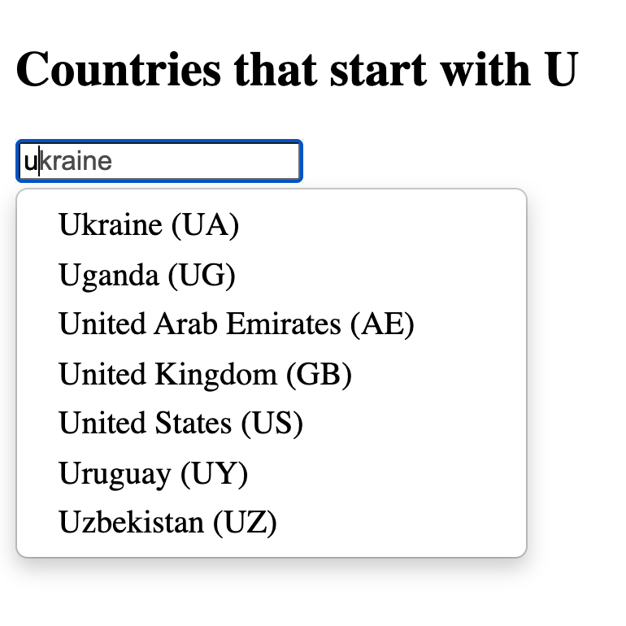
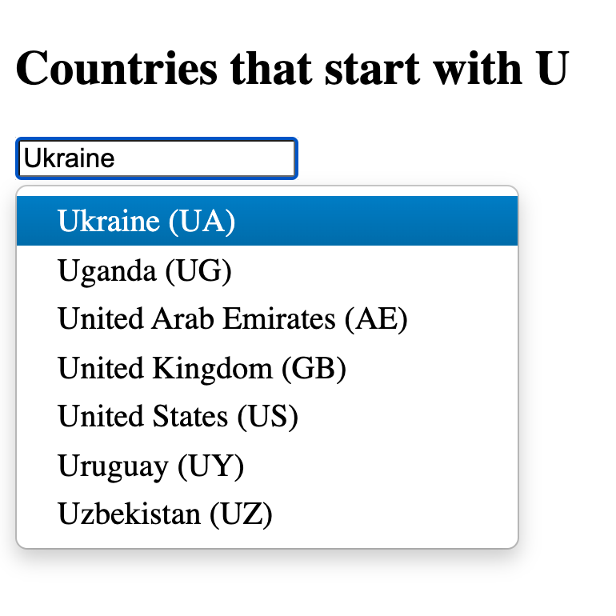

I decided to try out Twitter's <a href="https://github.com/twitter/typeahead.js/" target="_blank">typeahead.js</a> the other day. It was bit confusing at first because I kept finding examples and tutorials that weren't working. Turns out that typeahead used to be part of <a href="http://getbootstrap.com" target="_blank">Bootstrap</a>, but it was <a href="https://github.com/twbs/bootstrap/releases/tag/v3.0.0" target="_blank">removed in version 3.0</a> to become its own standalone project. So if you're looking for documentation on typeahead.js, just be sure that you know which project it's talking about (the <a href="http://getbootstrap.com/2.3.2/javascript.html#typeahead" target="_blank">old component</a> under Bootstrap, or the <a href="https://github.com/twitter/typeahead.js/" target="_blank">new standalone project</a>), because the implementation is completely different.

## Example

The standalone version of typeahead.js is more powerful and flexible. Here's a quick example of how you can use it:

```html
<!DOCTYPE html>
<html>
<title>Typehead.js Example</title>
<head>
    <script src="//ajax.googleapis.com/ajax/libs/jquery/1.10.2/jquery.min.js"></script>
    <script src="typeahead.js/typeahead.min.js"></script>
    <script src="hogan.js-master/web/1.0.0/hogan.min.js"></script>
    <link rel="stylesheet" href="typeahead.js-bootstrap.css">
    <style>
        .tt-dropdown-menu { min-width: 250px; }
    </style>
</head>
<body>

<h2>Countries that start with U</h2>
<input type="text" class="example" />

<script>
var data = [
    {
        "value": "Ukraine",
        "url": "http://en.wikipedia.org/wiki/Ukraine",
        "country_code": "UA"
    },
    {
        "value": "Uganda",
        "url": "http://en.wikipedia.org/wiki/Uganda",
        "country_code": "UG"
    },
    {
        "value": "United Arab Emirates",
        "url": "http://en.wikipedia.org/wiki/United_Arab_Emirates",
        "country_code": "AE"
    },
    {
        "value": "United Kingdom",
        "url": "http://en.wikipedia.org/wiki/United_Kingdom",
        "country_code": "GB"
    },
    {
        "value": "United States",
        "url": "http://en.wikipedia.org/wiki/United_States",
        "country_code": "US"
    },
    {
        "value": "Uruguay",
        "url": "http://en.wikipedia.org/wiki/Uruguay",
        "country_code": "UY"
    },
    {
        "value": "Uzbekistan",
        "url": "http://en.wikipedia.org/wiki/Uzbekistan",
        "country_code": "UZ"
    }
];
$('.example').typeahead({
    name: 'example',
    local: data,
    limit: 7,
    template: "<p>{{value}} ({{country_code}})</p>",
    engine: Hogan
}).on('typeahead:selected', function(event, datum) {
    window.location = datum.url
});
</script>

</body>
</html>
```

This example uses a local data source and illustrates how to use a simple template with hogan.js. It also uses one of the custom events provided by the API to run a callback function when an item is selected from the list. In this case we're simply grabbing the URL of that item and pointing the browser there.

It looks like this:

*Shows suggestions as you type*



*Arrow down to choose one*



If you saved any custom properties in your datum objects, you can access them later in the template and the callback function. In both cases the datum object is passed as an argument. In the template use the double mustache notation: `{{my-property}}`. In the callback function just use standard object notation: `datum.my-property`.

## Resources

Download a copy of the script or link to it somewhere. You'll also need a copy of <a href="https://github.com/jharding/typeahead.js-bootstrap.css" target="_blank">the CSS file</a>, unless you want to style it from scratch. If you plan to use a custom template for your typeahead suggestions, then you'll also need a template engine. Twitter has an open-source one called <a href="http://twitter.github.io/hogan.js/" target="_blank">hogan.js</a> that's pretty easy to use. See the <a href="http://twitter.github.io/typeahead.js/examples/" target="_blank">examples page</a> for a sample of how you can use a custom template.
